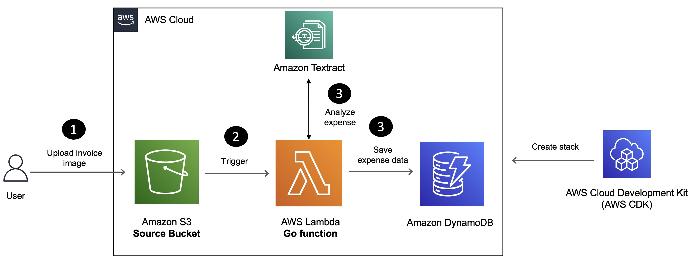

## Build a Serverless Application to Automate Invoice Processing on AWS

* [Build a Serverless Application to Automate Invoice Processing on AWS](https://buildon.aws/tutorials/invoice-processing-textract-lambda-golang)

In this tutorial, you will learn how to build a Serverless solution for invoice processing using [Amazon Textract](https://docs.aws.amazon.com/textract/latest/dg/what-is.html?sc_channel=el&sc_campaign=datamlwave&sc_content=invoice-processing-textract-lambda-golang&sc_geo=mult&sc_country=mult&sc_outcome=acq), [AWS Lambda](https://aws.amazon.com/lambda/?sc_channel=el&sc_campaign=datamlwave&sc_content=invoice-processing-textract-lambda-golang&sc_geo=mult&sc_country=mult&sc_outcome=acq) and the [Go](https://go.dev/) programming language.

Amazon Textract is a machine learning service that automatically extracts text, handwriting, and data from scanned documents. It goes beyond simple optical character recognition (OCR) to identify, understand, and extract data from forms and tables. It helps add document text detection and analysis to applications which help businesses automate their document processing workflows and reduce manual data entry, which can save time, reduce errors, and increase productivity.

Here is how the application works:

1. Invoice receipt images uploaded to [Amazon S3](https://docs.aws.amazon.com/AmazonS3/latest/userguide/Welcome.html?sc_channel=el&sc_campaign=datamlwave&sc_content=invoice-processing-textract-lambda-golang&sc_geo=mult&sc_country=mult&sc_outcome=acq) trigger a Lambda function.
2. The Lambda function extracts invoice metadata (such as ID, date, amount) and saves it to an [Amazon DynamoDB](https://docs.aws.amazon.com/amazondynamodb/latest/developerguide/Introduction.html?sc_channel=el&sc_campaign=datamlwave&sc_content=invoice-processing-textract-lambda-golang&sc_geo=mult&sc_country=mult&sc_outcome=acq) table. 

## Security

See [CONTRIBUTING](CONTRIBUTING.md#security-issue-notifications) for more information.

## License

This library is licensed under the MIT-0 License. See the LICENSE file.
